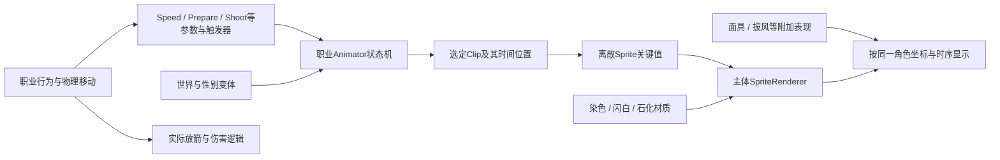

# 《王国：两位君主》原创角色动画制作规范与英雄闪烁调查

更新：2026-09-15。用途：以后制作英雄职业时，先按原版的动作、时间轴和生命周期建立规格，再画原创素材和接线。

**本轮完成的是原版机制研究与现版差异调查，未修复或重新部署英雄。** 当前 FAE6FBDD 候选仍有用户报告的移动闪烁。日志证明部分动作帧在推进，但没有视频、完整逐帧状态与撤销原因，不能宣称已确定唯一根因。

## 1. 版本和证据边界

| 项目 | 已核事实 |
|---|---|
| 游戏 | 本机 2.4 IL2CPP，独立副本 Build.22992091 |
| 引擎 | 本次启动日志明确为 **Unity 6000.0.61f1**；不要沿用旧 Mono 游戏的 Unity 2022.3 环境 |
| 当前 MOD | 7.6.5-hero-walk-scale-20260915，DLL SHA256 `FAE6FBDDCEF13DCE3D84120989087CB2972528097325EABF7FD987BC3BC50674` |
| 资源证据 | 当前安装的 `resources.assets`、`sharedassets0.assets`；8 个控制器、15 个弓手 Clip、164 个离散换图关键值 |
| 行为代码证据 | `game-source/Assembly-CSharp-2.1.0/` 是 **2.1 参考代码**，本轮未逐函数反编译验证 2.4 原生机器码 |
| 运行证据 | 冻结本次日志，含 45 条帧首见记录、16 条当选记录、12 个不同当选 actor；不是逐帧录像 |

本轮新解码的 Clip 时间轴比早期 `pptrCurveMapping` 图集列表证据更强：映射列表只给出引用集合，不能单独证明播放顺序。现在读取了实际 streamed 数据，校验了离散通道、常量系数、索引范围、初值、结束标记和完整字节消耗。

资源定位必须是 **资产文件 + pathID**，不能跨文件只按 pathID，也不能仅用同名 Sprite。旧提取曾把同名 Greed 弓手混进人类弓手，后续不得重复。

## 2. 原版如何形成一个活动人物

基础弓手的主体是一张完整人物 Sprite：头、躯干、腿和弓的姿势已经画进每张图。运行时 Animator 根据状态和 Clip 的时间轴，切换 SpriteRenderer 的 Sprite。它不是把静态头、手、腿每个渲染帧临时拼成一个新动作。

当前 `Archer` prefab（resources:19817）同时有 SpriteRenderer、Animator、Mover、Character、Damageable、AnimationSync、BiomeAnimationSwapper、GenderAnimatorSelector、Petrifiable、Embarkee 等组件。基础 Sprite sharedassets0:8941 的骨骼列表为空、PPU=32、pivot=(0.5,0)。这些证明的是**该弓手主体**，不能推成全游戏所有角色都没有附加部件。面具、盾牌、武器特效等可以另有对象或渲染层。

**渲染帧、动作帧、行为状态不是同一件事。** 游戏可以每秒渲染很多次，但基础走路 Clip 每秒只换 6 张图；两次换图之间，角色的位置仍由游戏更新。顺畅来自有设计的动作轨迹、合理停留时间、稳定锚点和正确切换，不能要求每个渲染帧都换新图，也不能用“加一个淡入淡出”代替这些工作。Unity 的对象引用动画接口也明确区分对象引用关键帧与普通数值曲线。[Unity 6 对象引用曲线](https://docs.unity3d.com/6000.0/Documentation/ScriptReference/AnimationUtility.SetObjectReferenceCurve.html)

## 3. 各职业没有统一的“六种动作模板”

以下为当前 2.4 资源中的状态名称摘要，参数、Clip、局部转换及AnyState摘要见 `controllers.json`，完整序列化控制器另保留在 `raw-controllers/`。摘要不是完整Animator执行模拟。它们是代表性样本，不是全游戏角色穷举。

| 控制器 | 状态数 | 动作拆分 |
|---|---:|---|
| archer | 7 | Stand、Walk、Run、Prepare、Shoot、Ghost Die、Spawn |
| peasant | 6 | Stand、Walk、Run、Bumped、Ground、Get Up |
| worker | 6 | Stand、Walk、Run、Hammer、Push、Stunned |
| knight | 11 | Stand、Walk、Run、Slash、Retreat、Block、Rally、PowerSlash、Land、Die、Spawn |
| knight_norselands | 11 | 包含 Defend、Block、Retreat、警戒待机等，不能照抄普通骑士表 |
| archer_norselands | 16 | 普通射击、持盾/防守、士兵姿态、取矛/弓/盾等多组动作 |
| archer_soldier_norselands | 8 | Stand、Walk、Run、Shoot、Prepare 2、GetShield、Retreat、GetBow |
| troll_peasant | 6 | 出生、Die、Holding Walk、Stand、Walk、另一待机 |

**受击未必是“当前弓箭手播放一段死亡图”。** 2.1 参考代码中，Character 受伤可能掉工具、替换成 Peasant，再由 Peasant 播放受撞、倒地和起身；满足条件时也可能直接回池。Archer 的 Demote 分支明确执行 ReplaceBy("Peasant")。因此新增英雄首先要明确“英雄身份在丢职业后是否结束”，再决定是否需要英雄的倒地全套素材，不能只给 Archer 填一个 Die 动作便声称覆盖受击。

石化也不只是换一组静止图：参考 Archer.StartPetrifyInternal 会变为 inert、暂停 Mover、关闭 Animator，然后交给 Petrifiable 的材质效果。隐藏接口还会设置 harmless、关闭主体 renderer，并处理盾牌。登船另有 Embarkee 与角色回调。**当前英雄不能被描述为天然继承了所有特殊动作的正确外观。**

参考代码定位：[Character.cs](C:/Users/ADMIN/projects/ohmymods/game-source/Assembly-CSharp-2.1.0/Character.cs:344)、[降级替换](C:/Users/ADMIN/projects/ohmymods/game-source/Assembly-CSharp-2.1.0/Character.cs:558)、[石化](C:/Users/ADMIN/projects/ohmymods/game-source/Assembly-CSharp-2.1.0/Archer.cs:2273)、[隐藏](C:/Users/ADMIN/projects/ohmymods/game-source/Assembly-CSharp-2.1.0/Archer.cs:970)。以上行为路径仍须与 2.4 实战核对。

## 4. 基础弓手的实际状态机

资源 `resources.assets:6128` 的参数为：Speed(float)、Idleness(float)、Prepare(bool)、Shoot/ShootPerfect/Die/Spawn(trigger)。

| 转换或设置 | 资源中的值 | 对制作的意义 |
|---|---|---|
| Stand → Walk | Speed > 0.005 | 不能自行把普通移动等同于某个“目标点”布尔标记 |
| Walk → Stand | Speed < 0.005 | 停止判据来自动画速度 |
| Walk → Run / Run → Walk | Speed > 1.0 / < 1.0 | 原版阈值为 1.0；当前英雄的 walkSpeed+0.05 是自定规则 |
| Stand → Prepare | Prepare 为真 | 拉弓有独立状态 |
| Prepare → Shoot | Shoot 或 ShootPerfect 触发 | 发射动作与准备动作分开 |
| Prepare → Stand | Prepare 为假，或 Speed > 0.005 | 原版准备动作可以被移动打断；“Prepare 永远盖住走路”不等于原版 |
| Shoot 的离开路径 | HasExitTime=true、ExitTime=1.0 | 有完成射击片段后再离开的约束 |
| Stand 播放速度参数 | Idleness | 原版待机不一定匀速循环；参考行为代码可把 Idleness 设为 0 或 1 |
| AnyState → Ghost Die / Spawn | Die / Spawn 触发器，默认状态为Stand | 这些动作槽有全局入口；存在入口不等于普通受击必定走Ghost Die |
| 上述状态间 Transition Duration | 本基础控制器均为 0 | 原版不是靠长时间交叉淡化来掩盖姿势不连续 |

注意：表中是序列化的转换设置，不能仅凭一个条件就忽略同状态的其他转换、触发器和引擎评估规则。Unity 的 Has Exit Time、转换条件和 Transition Duration 是不同概念，零过渡时长也不等于没有状态时序。[Unity 6 动画转换](https://docs.unity3d.com/6000.0/Documentation/Manual/class-Transition.html)

2.1 参考驱动链为：Mover 正常更新时把 `abs(rigidbody.velocity.x)` 写入 Animator 的 Speed，暂停分支写 0。Archer 的射击协程设置 Prepare，调用实际放箭，再设置射击触发器；AnimationSync 负责相关参数/触发器同步。当前“实际射出箭”和“显示哪张射箭图”仍应保持可核对的对应关系，不能让视觉时钟额外产生箭矢或伤害。[Mover.cs](C:/Users/ADMIN/projects/ohmymods/game-source/Assembly-CSharp-2.1.0/Mover.cs:239)、[Archer 射击流程](C:/Users/ADMIN/projects/ohmymods/game-source/Assembly-CSharp-2.1.0/Archer.cs:1000)、[AnimationSync.cs](C:/Users/ADMIN/projects/ohmymods/game-source/Assembly-CSharp-2.1.0/AnimationSync.cs:30)。

## 5. 动作应按什么帧与时间来画

以下“关键值数”已由 streamed 离散数据解码，不是根据 Clip 时长乘采样率猜出的数量。时长为资源时间轴长度，运行时可能受 Animator/状态速度影响。

| 动作槽 | 基础弓手：关键值数 / 标称采样率 / 时长 | 希腊男弓手 | 希腊女弓手 |
|---|---|---|---|
| 待机 | 10 / 6 / 1.667s | 19 / 6 / 8.0s | 18 / 6 / 9.333s |
| 行走 | 6 / 6 / 1.0s | 9 / 6 / 1.5s | 9 / 6 / 1.5s |
| 奔跑 | 6 / 8 / 0.75s | 10 / 8 / 1.25s | 10 / 8 / 1.25s |
| 准备射击 | 4 / 8 / 0.5s | 26 / 12 / 2.167s | 26 / 12 / 2.167s |
| 射击 | 5 / 8 / 0.625s | 3 / 10 / 0.3s | 3 / 10 / 0.3s |

希腊准备/射击槽使用投掷姿态图，不能把这些图当作神器弓拉弦的造型基线。原创弓手可以借鉴基础弓手的弓箭动作，但仍须决定怎样与所在世界的控制器时长一致。

**关键值数也不等于不同图片数。** 希腊男/女准备槽各有26个换图关键值，但实际各只引用6张不同Sprite，包含重复使用；不能因此要求原创角色机械地画26张独立准备图。

基础行走的真实换图时刻为 0、1/6、2/6、3/6、4/6、5/6 秒，1 秒循环。希腊待机则含明显长停留：女待机某些图保持 2、1、2.5、1.5 秒，男待机也有 1.333、2.5、1.5 秒停留。**一张图可以保持很久；图集序号和均匀 FPS 不是完整播放规格。**

这 15 个 Clip 中，3 个 run Clip 各有 2 个 `PlayRunningFootstepSound` 事件（0 和 0.375s）；其余 12 个没有事件。本组未发现出箭动画事件，不能据此宣称全游戏都没有，也不能把脚步事件误认为 Sprite 换帧驱动。

时间轴与换图解码见 [clip-timelines.json](C:/Users/ADMIN/projects/ohmymods/artifacts/hero-animation-study/20260915/clip-timelines.json)。独立格式交叉核对参考了 [AssetStudio 的 StreamedClip 读取器](https://github.com/Perfare/AssetStudio/blob/master/AssetStudio/Classes/AnimationClip.cs)，并仅处理本轮校验通过的单离散 Sprite 通道；不是通用所有动画格式解析器。

## 6. 像素角色要如何保持连贯

### 固定角色坐标，不逐帧自动“居中”

基础弓手参考 rect 为 32×32、PPU=32、pivot=(16,0)像素。画布可以为长弓、披风扩宽，但原点、脚底地面线、躯干基准和弓弦/手部定位要明确。每张图都以同一角色坐标绘制，不能根据各自非透明包围盒重新居中。

原版奔跑参考图在固定 pivot 下，部分帧的可见下沿离地 1–2 像素；这是原图保留的相位差异。我们的 `prepare-pixels.py` 用每张图的包围盒底部计算 shift，把包围盒的排他下边界统一设为 y=30（最低非透明像素通常在 y=29）；当前 hero run 四帧的该边界全为30，原版对应六帧为30、28、30、30、29、30。这样的自动整理会消除整张图的离地差异，不能用于最终跑步动画的对齐验收。

此外，旧脚本先缩整张生成图、量化颜色，再统一清除 x<23 的内容并裁掉红飘带。这只是草稿整理手段，不是动作制作规范；可能删去伸出的肢体或装备，应逐帧检查安全边界。当前 hero run 第0帧包围盒右边已经到画布右边48，至少需要复查是否截断，不能仅看“PNG透明且尺寸正确”就验收。

### 先画关键姿势，再画连接姿势

对行走建议明确左右脚接地、承重下沉、交错经过、抬步；奔跑还要保留蹬地与腾空。这里是原创制作建议，**不是把某一原版帧强行命名为解剖学动作**。先在固定地面线和骨架草图上安排重心，再画衣物、弓和飘带。头罩大小、脸朝向、身体厚度和弓的轮廓应跨帧一致。

起步、停止、走转跑、转身、移动中准备攻击、射击后回位，都要检查动作边界。单段循环好看不等于状态间衔接正确；更不能把四张相似的独立概念图直接当作成套行走。

### 分开审核造型、节奏与渲染

先以原始像素和整倍 nearest 放大检查，再按实际游戏尺寸检查。0.9是用户确认的视觉大小目标；分数缩放可能产生像素覆盖变化，是否贡献当前“闪”尚未证实。后续可考虑直接按更小的目标像素高度制作，而不是只依赖运行时0.9缩放，但不能未经对照就声称换了方法必然消除闪烁。

原始 Sprite 的材质染色、命中闪白、石化 UV/纹理约定也必须验证。复制原 renderer 的材质和属性不等于任意新 PNG 自动兼容这些效果。主体、飘带、弓箭分别遵循什么坐标、遮挡、调色规则，应进入素材规格。

以下为固定原点的离线对比，非游戏截图；原版图由资源裁剪重建参考画布，英雄为现有 atlas，未应用运行时0.9及动态布料。包围盒/像素重叠率仅用于找差异，不是“丝滑评分”。

[行走离线动画](C:/Users/ADMIN/projects/ohmymods/artifacts/hero-animation-study/20260915/walk-comparison.gif) · [奔跑离线动画](C:/Users/ADMIN/projects/ohmymods/artifacts/hero-animation-study/20260915/run-comparison.gif)

## 7. 当前英雄与原版的差异，以及闪烁能证明到哪里

| 项目 | 当前实现/现场证据 | 本轮结论 |
|---|---|---|
| 帧机是否运行 | 日志出现 Run 8/9/10/11、Walk 4、Idle 0–3 | 部分帧确实成功赋值，不能继续把问题一概归为没更新 |
| 状态机 | 自写6状态16帧；走/跑转换重置相位；门槛walkSpeed+0.05 | 与原生7状态和1.0门槛不同；原生也会切状态，不能只因有重置就认定有bug |
| 准备动作 | 当前Prepare持续优先于移动 | 与原生Prepare可被Speed打断有明确差异；本次记录中的prepare为false，不能归为这次闪烁原因 |
| 待机速度 | 当前固定6fps循环4帧 | 没有跟随原生Idleness停播规则，也没有原生长停留时间轴 |
| 走/跑记录 | 有速度0.59的Walk和0.73等的Run记录 | 证明发生过分类变化；首见日志不能证明连续高频抖动或每帧重启 |
| 英雄身份 | 16条selected涉及12个actor，也有同actor重复selected | 证明发生过当选/重建记录；无法排除玩家开关、读档、岗哨分配等正常原因 |
| 资格与显示耦合 | 即时IsHero失败会移除自有表现，后续可重选/补挂载 | 是需要观测的闪回原皮路径；当前没有撤销原因日志，不能确定哪个字段在振荡 |
| 更新时序 | ModPanel.Update先调用Sync，LateUpdate按同帧标记跳过 | 实际采样不再保证发生于动画更新之后；影响需查真实执行时序，不能只凭代码认定为闪烁主因 |
| 帧素材 | 4张walk/4张run，自动bbox贴底、逐格缩小量化 | 与原版帧节奏、腾空高度和制作方式不同，需重做正式动作而非继续把草稿当成完稿 |

当前日志只记每个 VisualState 中某帧号首次出现。重复当选可能来自用户操作，`range=15`也不能直接认定为某种职业。不能据此写“高频资格振荡已证实”“已排除所有其他原因”或“Prepare视觉天然等同原版”。本轮也没有获得用户画面或完成渲染级复现。

Unity 将脚本、动画和渲染安排在不同阶段；依赖原生动画的自定义显示必须在恰当阶段读取结果。当前“谁先调用Sync谁拿到本帧”的做法值得单独验证，不能把去重正确等同于时序正确。[Unity 6 执行顺序](https://docs.unity3d.com/6000.0/Documentation/Manual/execution-order.html)

## 8. 后续原创角色应采用的实施路线

### 先稳定身份，再对接原版动画结果

英雄身份、是否允许攻击、当前能否显示英雄外观，应拆开考虑。死亡、职业永久变化、关功能需要归还；临时受击、动画状态、初始化窗口不应未经分析就反复撤销重选。具体资格策略仍需保留原有每侧最多一名等约束，并用撤销原因记录验证，不能为了不闪烁就让无效对象永久保留英雄战斗能力。

原创视觉优先跟随**原生已经选好的动作及其时间位置/当前Sprite**，不要仅凭Speed和Prepare再猜一套精简状态机。原版已有世界、性别、职业的Override结构；例如希腊女弓手 override资源19324，指向基础控制器6128，只替换五个动作Clip。

候选实现路径有两种，必须先做小原型再选定：

1. 保留原生 Animator，在合适更新阶段读取已选 Sprite/状态，将其映射到对应原创帧。映射按控制器、动作和资源身份建立，不能只按重名 Sprite 全局替换；未知/未制作状态显式交还原版。
2. 在匹配当前 **Unity 6000.0.61f1** 的制作环境中离线生成原创 Sprite Clip/资源包，使用每角色持有的 AnimatorOverrideController 替换动作，同时保留原生状态与参数。必须验证世界/性别换皮不会覆盖它、关闭和回池可以归还、事件不重复触发、Clip时长与退出条件相容。

OverrideController的作用是保留控制器逻辑并替换动作Clip，不代表本项目已经验证了IL2CPP运行时加载方案。制作 Sprite 对象引用曲线的 AnimationUtility 属于编辑器接口；不能把Editor示例直接塞进已发布游戏DLL。[Unity 6 Override Controller](https://docs.unity3d.com/6000.0/Documentation/Manual/AnimatorOverrideController.html)、[对象引用曲线API](https://docs.unity3d.com/6000.0/Documentation/ScriptReference/AnimationUtility.SetObjectReferenceCurve.html)

不建议把当前六状态草稿帧机直接定为所有未来英雄的通用模板。也不能只说“沿用原版AI，所以特殊动作自然都完成了”。主体未绘状态、附加布料何时隐藏、命中材质和换职业后的身份都要有明确覆盖表。

### 每个新英雄的交付顺序

1. 确定角色家族、世界/性别控制器、全部动作槽、真实时刻与生命周期路径。
2. 写动作规格：Clip、关键值时刻、循环/停留、状态入口/出口、pivot、像素尺寸、材质和附加层。
3. 在固定角色坐标中画原创关键姿势与连接帧；先检查走/跑循环和跨状态边界，再加装饰细节。
4. 离线用真实时间轴预览；标出缺动作、缺连接或被截断的肢体，不能以构建通过替代目视验收。
5. 只做一个最小游戏原型，验证原生状态跟随、显示交接和贴图一致性，再扩展攻击与特殊动作。
6. 完成原尺寸实测：站、左右走/跑、急停、转身、拉弓中移动、射击、受击/掉职业、石化、被抓、登船、开关、回池、换岛/读档。联机要单独完成主客一致性，当前英雄仍不支持在线。

第一版原创弓手可把基础弓的 10待机/6行走/6奔跑/4准备/5射击作为讨论规格，**不是“照抄帧数就完成”**。最终帧数取决于选定控制器、时长和动作设计；Ghost Die/Spawn等槽与特殊材质也不能遗漏。

## 9. 下一轮最小诊断与验收

先用一名固定英雄做短时对照。记录带游戏时间与frameCount的动作转换、原生state/normalizedTime/Sprite、英雄frame、renderer可见性、身份撤销原因和用户开关变更；只在变化时记录，并设置全局总量上限。首见日志适合确认走过哪个分支，不适合量化频率。

分别判断四类现象：整个英雄与原版皮肤交替、同一动作从首帧反复重来、画面持续存在但轮廓/重心跳变、薄像素边缘随位移闪动。它们需要不同修法，不能再用一个“动画bug”概括。

对照应尽量一次只改一个变量：固定英雄身份、跟随原生状态、替换一套经审核的动作帧、调整像素尺度/材质。必须结合游戏画面验证；不会因为单元测试有上万条就把这些标记为实测完成。

## 10. 可复用证据和更新规则

- [资源提取脚本](C:/Users/ADMIN/projects/ohmymods/artifacts/hero-animation-study/20260915/extract_study.py)：只读实际安装资源，输出8控制器/15时间轴；校验不符合格式则拒绝解码。
- [控制器与转换表](C:/Users/ADMIN/projects/ohmymods/artifacts/hero-animation-study/20260915/controllers.json)、[时间轴](C:/Users/ADMIN/projects/ohmymods/artifacts/hero-animation-study/20260915/clip-timelines.json)、[资源哈希与统计](C:/Users/ADMIN/projects/ohmymods/artifacts/hero-animation-study/20260915/extraction-summary.json)。
- [当前实现动画机](C:/Users/ADMIN/projects/ohmymods/il2cpp/HeroArcherAnimation.cs:24)、[移动分类](C:/Users/ADMIN/projects/ohmymods/il2cpp/HeroArcherMotion.cs:37)、[显示接线](C:/Users/ADMIN/projects/ohmymods/il2cpp/HeroArcherVisuals.cs:336)、[草稿整理脚本](C:/Users/ADMIN/projects/ohmymods/artifacts/hero-archer/20260914/prepare-pixels.py:32)。
- 本轮日志、代码基线、worker调查和最终复核存入 `docs/project-harness/tasks/hero-animation-study-20260915/`；worker中未经证实的因果判断不等于本规范结论。

更换游戏版本或制作环境后，重新核对资源哈希、实际引擎版本、控制器、时间轴和材质。文档新增结论必须注明来自当前资源、参考代码、现场观测还是推测。研究脚本生成的图片是本机原版参考，不应被称为原创英雄成品。

### 2026-09-15 原生动作修订候选（替代此前Speed分类和16帧自主时钟）

当前HeroArcherNativePose仅采样Animator current shortNameHash/normalizedTime，转场也不预取next；Stand/Walk/Run循环、Prepare/Shoot单次clamp。31槽为10/6/6/4/5，其中18张不同图，保持帧有意复用。统一头身像素与固定pivot，不能把每帧bbox贴底抹去腾空。已绘动作按native状态相位均匀采样，不声称精确覆盖所有世界稀疏Sprite关键值时间轴。

未知/Animator停用/非法相位时隐藏自有body/cloth并归还原生，保留对象避免重建；回到支持动作再接管。原生隐藏所有权必须在setter之前登记，以应对写入后抛异常。NotifyRelease不重置姿势时钟。ModPanel和自有驱动只在LateUpdate采样，共用frameCount去重。

长红双飘带为独立动态网格，body atlas没有烘焙整条尾巴；肩锚随对应躯干提升0/1/2像素，并保持整体0.9和英雄显示优先级。离线组合预览只用真实布料核心+合成输入，不是实机证据。

73姿势、57真实接线stub及原有回归/素材校验/真实2.4构建/独立review通过，本机EFD44621已闭游戏备份安装；尚未实测，仍不能宣称轮廓跳变已完全消除、所有特殊动作已完成或联机可用。详细证据见 tasks/hero-native-animation-fix-20260915/acceptance.md。

### 2026-09-15 长飘带起跑展开与停步回落

2026-09-15 英雄飘带候选 1278D0D5 / 7.6.5-hero-cloth-flight-20260915：按用户授权改善站立下垂、跑动逐渐扬起、停步缓落。仅改布料纯链模拟的有符号速度包络、有界拖曳/抬升与空气阻尼；保持8节点/30Hz、波纹/段长/地面/Reset和无逐帧分配。取消新增flow镜像，修转向立停永久前折；既有低速贴地折向瞬跳尚存，未称全程无跳。31槽native动画、肩锚/0.9/置前/贴图/战斗不变。68cloth（两项语义适配）/45flight/72turn/33view/57nativevisual/73pose/65runtime、同输入预览、真实2.4与普通构建0W0E、2664旧方法保持/3授权修改/嵌入图逐字节一致及独立review通过；已闭游戏备份安装，save/config哈希保持，未启动游戏，未提交/发布。真实游戏观感仍待验，英雄整体doing、在线仍关闭。

速度包络应有起跑和停步响应，不能仅用瞬时速度驱动而在停下时骤然清空展开力；转向需要同步变换保留的有符号气流。增加拖曳/抬升时还需检查起跑过冲、地面折叠和空气阻尼，不能只看稳定跑步一帧。旧3.5跑速测试不足以验证合成1.2–1.6范围，使用同输入新旧坐标+组合预览，并区分模拟和实机证据。维持有限节点、固定步、有界力和无逐帧分配，避免引入额外全场扫描。

### 2026-09-15 双尾长围巾：布面与触地必须一起核验

2026-09-15 双尾长围巾候选 7DD53270 / 7.6.5-hero-twin-scarf-20260915：颈肩31帧只改围巾连接小区域；双尾主体3–4/末2–3素材像素截面、双平涂折面、轻微宽度变化，56顶点/84索引每链且复用缓冲。副链物理锚(-1,+3)，可见根0/1下移2/1px连接颈环，火红副尾与红主尾区分；2/1.5px整数地面包络、drag.9和Chain动力学原文保持。31槽动作/.9/置前/金箭/战斗保留。相关回归、真实网格离线预览、2.4/普通完整构建、IL/neck像素审计及独立review通过；已闭游戏备份安装，save/config哈希保持，未启动游戏/提交/发布。实机观感待验，旧急转折地瞬跳和半透明接缝叠色边界仍记录，英雄doing/在线关闭。

加宽布面会改变地面包络和节点接触分类，即使Chain源码未改，也不能宣称所有动态必然不变。整数像素地面G、中心y≥G+H且半宽≤H时，Round(y−width/2)≥G；额外半像素余量在此场景不必要，可能带来抖动和贴地退步。若改成非整数地面，重新证明。

预览应导出实际Cloth.Create/Tick生成的vertices/colors/triangles，按像素中心栅格化；绘制近似线条或Pillow包含边界的宽线会夸大/误报布面。每quad同色且顶点独立可避免跨面渐变；检查相邻段连通、覆盖和半透明叠色，不只测单个三角形面积。cardinal截面宽不等于屏幕法向宽。

双尾辨识需要检查真实组合图，不能仅由两个Renderer数量推断。此次最终用上方副物理锚保浮起、纯呈现短根桥回接颈环、静态明暗配色区分；不写回模拟点。根桥与颈肩像素共同随原生姿势躯干提升，31槽/脚锚保持。
