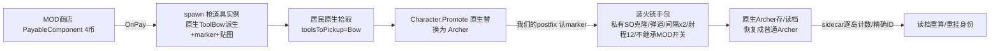

# 火铳手（Musketeer）原生集成侦查 — scout 报告

已阅：`plan.md` / `scout-worker.md`。本轮只读 + 本文件落盘，未改任何生产代码、未构建、未安装、未动游戏/存档/Git。
证据分级：**[2.4生产]** = 本仓库已有实机/生产代码证明（interop 签名 + 运行证据）；**[2.1逻辑]** = `game-source/Assembly-CSharp-2.1.0/` 只读逻辑说明书；**[infer]** = 推断；**[待operator]** = 必须用真实 2.4 interop 复核。

---

## 0. 结论摘要（decision-first）

**推荐最小可靠架构（沿用仓库已证范式，不发明新机制）：**

1. **职业本体 = 原生 Archer + sidecar 身份包**（与弩手 `CrossbowmanMarker` 同族：Selected/Active/Residue + life 边界 + 借用账本）。不克隆 Character prefab、不注册自定义 tag、不新职业池。
2. **枪道具 = 原生 `ToolBow` 派生实例 + marker 组件**，`tag` 保持 `"Bow"`：
   - 居民拾取走原生白名单（`Peasant.toolsToPickup` 已含 `"Bow"`）→ 无需改拾取；
   - 转职映射走原生 `Character.Professions["Bow"]="Archer"` → 无需改职业表；
   - 转职瞬间在既有 `Character.Promote(DroppableTool,IUnitController)` postfix 里认 marker，把新 Archer 装成火铳手包（**[2.4生产]** 该 hook 已有三处命中先例）。
3. **商店 = MOD 自有 payable**（HeroShop 范式：`IPayableComponentOwner` + 原生 `PayableComponent` 付款/退币 + `CRPCStamp` + SemiStatic header），价格 4；不使用 ShopPlanner 槽位（跨世界无稳定空闲槽，见 §4）。
4. **持久化 = MOD sidecar（复用英雄的 context/fingerprint/Save/Load 桥）+ 原生 Archer 本体重建**；精确 per-unit 映射可后置，先做「逐岛计数 + 失败 fail-closed」。
5. **联机：第一版整体 fail-closed**（`HasWorldAuth && !IsOnline`，与英雄 `HeroArcherNetwork.AllowsLocalHero` 同门），报告里明示离线限制。
6. **不继承**散射/射速/火矢/英雄的排除点各只有一个函数（见 §3.4），全部已有生产先例；**两处必须处理的新冲突**：弩手转职钩子与弩手读档重算会误吃火铳手（§3.5）。

---

## 1. 原生链路事实（先分流 2.1 逻辑 vs 2.4 实锤）

### 1.1 商店→工具→拾取→Promote→ReplaceBy（[2.1逻辑]，2.4 端点见 §1.4）

- `PayableShop.Pay()` → `CreateItem(true)`：`Pool.Spawn<Droppable>(itemPrefab, …)` + `dropper` + `GetComponent<Rigidbody2D>().isKinematic=true` + 本地/远程 Blink；随后 `AddItem` 把道具摆到货架（`itemPlacement`+`itemSpacing`，`parentShopRef=this`）。证据：`game-source/Assembly-CSharp-2.1.0/PayableShop.cs:200-400`。
- 货架库存**进存档**：`PayableShop` 实现 `Persistent.IBehaviour`，`RetrieveData` 存 `items: List<PersistentLink>`，`ApplyData` 按链接回填。同文件 `:340-395`。
- 居民拾取：`Peasant.OnTriggerEnter2D` 先查 `Peasant.toolsToPickup.Contains(droppableTool.tag)` → `HandleToolPickup`：`tool.pickedUp = true; this._character.Promote(tool, null); Pool.Despawn(tool.gameObject, true)`。证据：`Peasant.cs:150-450`（OnTriggerEnter/HandleToolPickup 段）。
- 白名单是 **private static readonly string[]** `{ "Pike","Hammer","Bow","Katana","Scythe","Shield","StableKeeperTool" }`（`Peasant.cs:451-693` 字段区）。
- 转化：`Character.Promote(DroppableTool)` → `Professions[tool.tag]` → `Promote(string)` → `ReplaceBy(newTag)`（**私有**）：`holder.GetCharacterByTag(newTag)` → `BiomeData.GetAssetSwap` → `Pool.Spawn<Character>` → 复制 parent/pos/scale/skinColor/outfitColor/wallet 币/速度/性别 → 调用方 `Pool.Despawn(旧对象)`。证据：`Character.cs:321-640`。
- `Character.Demote()` 按 tag 分支：`"Archer"` → `ReplaceBy("Peasant")`（`Character.cs:321-640`）。
- `Character.Professions`（`Character.cs:641-944` 字段区）是 **private static** 字典；`Bow→Archer, Katana→Ninja, BerserkerTool→Berserker, …`。

### 1.2 单位/道具的原生存档（[2.4生产] + [2.1逻辑]）

- 只有 `Persistent.ShouldPersist()` 的对象进存档（`IslandSaveData.cs:422-521` Save 循环）。
- 每条 `ObjectData` 存：`name / hierarchyPath / prefabPath(= Persistent.path) / uniqueID / mode / netID / crpcType / localPosition / localScale / componentData2`（`IslandSaveData.cs:1380-1808`）。
- `componentData2` 对每个 `Persistent.IBehaviour` 组件记 `{name=组件 FullName, type=数据 FullName, data=JSON}`；**加载端用 `Type.GetType(componentData.name)` / `GetComponent(Type.GetType(...))` 解析**（`IslandSaveData.cs:522-700`）。→ **mod 类型（KingdomEnhancedMod.*）不在 calling assembly，解析会失败并记错误**。推论：自带 marker 组件**不得**实现 `Persistent.IBehaviour`（否则存档污染 + 读档报错）。
- **恢复（关键）**：`IslandSaveData.TryCreateOrFind`（`IslandSaveData.cs:703-...` 段）：
  1. `Resources.Load<GameObject>(objectData.prefabPath)`；
  2. `pools.GetPoolByPrefabName(loadedPrefab.name)` 命中则 `FastSpawn(localPosition, …, netID, !HasWorldAuth)`，否则 `Instantiate`；
  3. 取 `Persistent` 组件建索引。
- **[2.4生产] 单位确实是按此路径保存/恢复的**：英雄模块直接以 `ObjectData.componentData2` 里 `name=="Character" && type=="CharacterData"` 认定单位记录（`HeroRecruitment.cs:640-660`），且用 `IslandSaveData.Save`/`GetID`/`TryPopObjectsToScene`/`TryCreateOrFind` 四个钩子做存档桥（`HeroRecruitment.cs:700-849` 的 `SavePatch/GetIdPatch/PopPatch/CreatePatch`）。骑士身份附加档同理。

### 1.3 池（[2.1逻辑] + [2.4生产]）

- `Pool.Despawn/TryDespawn` 只认两种归属：`origin` 字典（本池生出的实例）或 `Persistent.path → poolsByPersistentPath`；都不命中就**什么也不做**（道具不会消失）。`Pool.cs:120-420`。
- 池注册时 `Pool.Init` 写 `poolsByPrefab[prefabGO]` 与 `poolsByPersistentPath[persistent.path]`（先到先得，不覆盖）。`Pool.cs:700-900`。
- `PoolManager.InitPools` 每次重置三个缓存；`CreatePoolFor(prefab)` 运行期建池；名字键 = `prefab.name`。`PoolManager.cs:30-120`、`:180-200`。
- **[2.4生产]** 运行期克隆 prefab 可建同步池：弩矢 `KEM_CrossbowBolt` 建 SO 克隆 + Arrow 克隆 + 独立 syncID（31000+ 分配器，跳过银行/幽灵保留段），并在 `PoolManager.Init` postfix 幂等重注册（`PatchRoles_Crossbowman.cs:430-560`、`:990-1020`）。

### 1.3b 跨 prefab 单位替换的既有先例（北境小队，[2.4生产]）

`PatchRoles_NorseSquad.cs:1-120`：把入队随从换成**另一个原生 prefab**（`Archer_norselands`）的做法是「窗口技巧」——在调用栈内临时改 `Holder.tagCharacterPairs["Archer"]=目标prefab`，调 **`Character.Promote(string, IUnitController=null)`（2.4 interop 已核实存在）**走 `ReplaceBy→Pool.Spawn` 池化同步路径，finally 恢复映射；新 prefab 的池用 `EnsurePoolForCharacter` 借建；读档后由**延迟 LoadRestore 上下文 + 有限重试 + 5s 巡检**补转化（`Pending/UncertainConversions/Attempts=24`）。

对本任务的意义：
- **`Promote(string)` 公开重载是 2.4 实锤**，因此"自定义转化路径"可以不碰 `Professions` 私有表；
- 但该先例能落档的前提是**目标 prefab 是 Resources 里的原生资产**（本任务没有原生火铳手 prefab）→ 结论不变：火铳手走原生 Archer 身份 + sidecar，而不是新 prefab；
- 读档重挂的"延迟登记 + 有界重试 + 巡检兜底"形态可直接照抄。

### 1.4 已命中的 2.4 原生 hook 清单（本任务会用的边界，全部 [2.4生产]）

| 边界 | 证据文件 |
|---|---|
| `Character.Promote(DroppableTool,IUnitController)` postfix（弓/锤/ BerserkerTool 三处命中；`__result`=新职业） | `PatchRoles_Crossbowman.cs:915-940`、`PatchRoles_Berserker.cs`、`PatchRoles_Worker.cs:120-160` |
| `Character.ReplaceBy(string)` prefix/postfix（角色替换/降级级联） | `HeroRecruitment.cs:760-800` |
| `Archer.Update`（每帧观测；散射/射速计时都从这里桥接） | `PatchArcher_Options.cs:950-1050` 附近钩子类 |
| `Archer._Shoot_d__225.MoveNext`（射击协程，长方法；调用期临时 cadence） | `PatchArcher_Options.cs:600-680` |
| `ArrowAttack.FireArrowInternal`（每发一次；真实放箭事件） | `PatchArcher_Options.cs:280-350`、`PatchArcher_GreekImpact.cs:1310-1330` |
| `Arrow.OnEnable` / `Arrow.TryDamage` / `Arrow.HitObject`（命中观测） | `PatchArcher_GreekImpact.cs:1330-1383`、`PatchArcher_Impact.cs:850-894` |
| `Archer.OnEnable`/`Archer.OnDisable` + `Pool.FastSpawn` 作用域（life 边界） | `PatchRoles_Crossbowman.cs:990-1066`、`CrossbowmanLifecycle.cs:95-320` |
| `Archer.IsAvailableForJob` / `AssignJob` / `SetGuardSlot` / `EnterGuardSlot`（岗位排除；英雄不上塔先例） | `HeroArcherTowerPolicy.cs`（整文件） |
| `PoolManager.Init`（池重建后重注册） | `PatchRoles_Crossbowman.cs:995-1010` |
| `World.OnLevelLoaded`（per-world 监督协程） | `PatchRoles_Crossbowman.cs:975-995` |
| `Character.Promote`/`Holder`/`Pool`/`IslandSaveData.*` 的 2.4 签名核对记录 | 各文件头注释 + `il2cpp/notes-roles.md` |

---

## 2. 关键问题逐条回答

### Q1：克隆 inert Archer prefab + 自定义 Holder tag + 自定义工具，沿用原存档 prefabName？

**不安全，不建议。** 具体阻断点（逐条有证据）：

1. **自定义 tag 不可用**：Unity 的 tag 集合是固定的，`gameObject.tag = "Musketeer"` 对未注册 tag 抛异常；游戏 tag 常量表（`Tags.cs` 2.1 全文）没有火铳手，2.4 资源也不会有。`CompareTag("Musketeer")` 返回 false，原生按 tag 的分支（Demote/统计/招募过滤等）全部走不到。
2. **职业映射不可加**：`Character.Professions` 与 `Peasant.toolsToPickup` 都是 private static（§1.1）；能改的只有既有 tag 的映射/临时替换（Berserker/Hammer 先例都建立在目标 tag 已存在上）。自定义工具 tag 若不在白名单，`OnTriggerEnter2D` 直接不触发拾取；若不在 Profession 表，`Promote(DroppableTool)` 抛 KeyNotFound。
3. **克隆 prefab 无法被原生恢复**：恢复只走 `Resources.Load(prefabPath)`（§1.2）。运行期克隆不在 Resources；`Persistent.path` 写什么都会落到「加载失败/加载成原生对应物」。即使把克隆的 `path` 指到原生 Archer 路径，恢复出来的是**原生 Archer**，克隆特有的组件/数值不会回来。
4. **连带风险**：克隆会复制 prefab 上的 `Persistent`（带 `path`），于是每个火铳手实例都会以克隆路径进存档 → 读档 `Resources.Load` 失败 → `Failed to depool / instantiate`，单位丢失。把 `persistObject=false` 又会与「读档找回已购单位」的需求冲突。
5. **Holder 注册本身可行**（`tagCharacterPairs.Add(tag, clone)` 不求 GO tag 一致；跨世界注册先例 `PatchRoles_Holder.cs:30-90`），**但只解决"能生成"，解决不了拾取、映射与存档恢复**。

结论：克隆 prefab 只适合**不落档的投射物/外观对象**（弩矢克隆先例），单位本体必须保持原生 prefab 身份。

### Q2：v2.4 是否允许自定义 prefab 的 Restore / pool syncID？

- **pool syncID：允许**（运行期池 + 固定/分配 syncID 已有两处生产先例：弩矢 31000+、幽灵小队 30130/30131；`PatchRoles_Castle.RegisterSyncedPool` 30000+，含保留段跳避）。→ 自定义**投射物**可以在同步池里工作。
- **自定义 prefab 的存档 Restore：不允许**（`Resources.Load` 单点，见 Q1.3；pit 24/pit 10 是同一机理的两次事故记录）。
- 因此：**投射物/工具可以克隆；单位本体不能**。

### Q3：native Archer 上的 sidecar 身份（普通 Archer 永不得英雄/散射）是否安全？

**安全，且是本仓库最成熟范式**：
- 弩手已用同一范式跑了多轮回归：marker 组件 + `Selected/Active/Residue` 三层 + `Pool.FastSpawn` 作用域 + `Archer.OnEnable/OnDisable` 定 life + 借用账本还原（`CrossbowmanLifecycle.cs:95-320`）。
- 读取器唯一判据是 `IsCrossbowman` 即时读配置与 marker（组件存在 ≠ 身份），普通 Archer 在无 marker 时零写入（同族 `IsNorseArcherInstance` 同）。
- 「普通 Archer 不得继承英雄/散射」的排除点各自单一（§3.4），加入火铳手判据即可；**风险是漏点**，所以下面给出完整排查清单。

### Q4：native BowTool + marker，以及商店库存持久化？

- 枪道具做成 `ToolBow` 派生实例 + marker 是**拾取与映射成本最低**的方案（Q1 论证）。
- **但道具的 marker 不随原生存档恢复**：货架道具由 `PayableShop` 的 `items: PersistentLink[]` 保存，恢复时按道具自己的 `prefabPath` 重建（§1.2）→ marker 丢失、变回普通弓。且 mod 组件**不能**用 `componentData` 持久化（`Type.GetType` 不解析 mod 程序集，§1.2）。
- 处置建议（任选，须明示限制）：
  - **(a) MOD 自有商店（推荐）**：道具不由原生 `PayableShop` 货架保存；把枪克隆的 `Persistent` 关掉（`persistObject=false`/`DontPersistInstance`），枪不落档。代价：读档后场上未拾取的枪消失（已付款但未拾取 = 损失一次购买），无 save 污染。
  - **(b) 原生槽位商店**：货架会保存，但克隆道具恢复仍失败（同 Q1.3）。若坚持，需要「恢复后再标记」的读档后协调（例如按 `ToolBow` + 位置/货架绑定重挂 marker）——脆弱，不建议第一版做。
  - **(c) 接受降级**：读档后货架上的枪变普通弓；不建议（会静默改变已付商品）。

### Q5：为什么不用 instanceID / island runtimeDateTime 做身份/持久化 key？

- `GetInstanceID`/pointer 在池复用、换岛、进程重启后都不可持续；跨实例匹配必须用原生稳定的 `uniqueID`（存档 JSON 里的字符串）+ 岛上下文（save 文件+campaign/challenge/land）。
- `IslandSaveData.realStartDateTime.Ticks` **不进原生存档**，每次读档重建——这正是英雄 v1 scope 失效的已确认根因（AGENTS 顶部 hero-save-restore 记录 + `HeroRecruitmentArchive.cs:50-60` 注释「Runtime DateTime ticks and instance ids are never part of it」）。
- 推荐 key 组合：`HeroRecruitmentArchive.ContextKey(file, campaign, challenge, land)` + `HeroRecruitmentFingerprint.Hash(json, scope)`（均为内部可复用函数，`HeroRecruitmentArchive.cs:50-70`、`HeroRecruitmentFingerprint.cs`）。

---

## 3. 战斗契约（hooks / 伤害 / 直线弹 / 排除门）

### 3.1 射击与目标选择（[2.1逻辑] 结构 + [2.4生产] 钩子）

- 原生射手决策：`Archer.Update` → `ShouldShootEnemy() || ShouldShootWildlife()` → `shoot.Start()`（`Archer.cs:700-1000`）。
- 敌人目标选择在 `ShouldShootEnemy()` 内：扫描器 `_enemyScanner.GetAll()` 过滤 `ActiveArrowAttack.Range >= |dx|`、目标 `Damageable.IsDamagedBy(DamageSource.Arrow)` 等，写入 `_shootingTarget`（`Archer.cs:1000-1300`）。
- 开火：`Archer.FireArrow(direction, perfect)` → `ActiveArrowAttack.FireArrow(gameObject, _shootingTarget, …)`（`Archer.cs:700-1000`）。
- 2.4 可用的长协程钩子：`Archer._Shoot_d__225.MoveNext`（唯一射击协程；弩手/射速模块共用，**[2.4生产]**）、`ArrowAttack.FireArrowInternal`（每发一次）。
- 火铳手发射走**同一原生管线**，只替换 `ActiveArrowAttack` 为私有克隆 SO（弩手先例），**不写自定义 fire loop**（自定义 loop 要自己复刻 `BestShot/ParabolaCast/Pool.Spawn/NetworkSoftSimulator/权威门`，是净负收益）。

### 3.2 伤害与命中（[2.1逻辑] API，命中钩子 [2.4生产]）

- 单位命中：`Arrow.HitObject(target, physicalHit)`（首次命中 `_hasHit` 短路；停住刚体、延迟 despawn）→ `Arrow.TryDamage(Damageable)` → `damageable.ReceiveDamage(hitDamage×perfect倍率, archer, _damageSource)`。证据：`Arrow.cs:30-300`；`Damageable.ReceiveDamage(int,GameObject,DamageSource)`/`IsDamagedBy`/`hitPoints`/`ApplyDelayedDamage`（`Damageable.cs:150-460`）。
- 命中观测的既有 2.4 钩子：`Arrow.HitObject` prefix/postfix（`PatchArcher_Impact.cs:850-894`，有 `_hasHit` false→true 的「原生是否接受命中」判定）+ `Arrow.TryDamage` 窄替换（`PatchArcher_GreekImpact.cs:1355-1383`）。
- 「首个地面敌人停止」= 原生 Arrow 的首次碰撞语义，天然满足（`_hasHit` 后停住）；要"不弹墙"就把克隆的 `canBounce=false`（**[待operator]** 字段存在性/可写性）。无穿透/AOE/灼烧：不设 `isFireArrow`、不挂任何 impact 来源（§3.4）。
- **2.4 类型名实锤**：生产代码的敌人判定用的是 `Damageable`（`collider.GetComponentInParent<Damageable>()`）+ `Enemy`（`GetComponentInParent<Enemy>()`），不存在 2.1 之外的命名（`PatchArcher_GreekImpact.cs:1290-1330`）。任务书里的 "enemyDamageable" 按 `Damageable.ReceiveDamage(int, GameObject, DamageSource)` 理解即可；**不要**假设存在独立的 `EnemyDamageable` API（[infer]，如需确认列 §8）。
- 「只攻击地面敌人」：原生 `_enemyScanner` 命中的所有 Enemies 层目标都会成为 `_shootingTarget`（含飞行单位如 Squid 一类的悬空敌）。**过滤点选择**：
  - 首选：在 `Archer.Update` postfix（已命中钩子）对火铳手做 O(1) 检查：`_shootingTarget` 非地面（例：目标带某个飞行组件/`Portal` 状态/层之外的海拔判据——**具体判据需 operator 定**，仓库已有的 Squid 先例是组件级排除，`PatchDivine_FriendlyTroll`/`FriendlyTrollDisguise` 有读法）；
  - 或：`Arrow.TryDamage` prefix 只挡伤害（箭已浪费，不推荐）。
  - **[待operator]**：确认 2.4 里"地面敌人"的可靠判据（Squid 组件名/层/`Enemy` 类型），以及 `Archer._shootingTarget` 字段 interop 可读。

### 3.3 弹道数值（以弩手为模板，数值改为火铳手需求）

弩手定稿参数（`PatchRoles_Crossbowman.cs:130-175`）可直接映射：

| 需求 | 机制 | 弩手先例值 |
|---|---|---|
| 基础伤害 2 | 克隆 Arrow `hitDamage` | 2（perfect 自动 ×2 → 4；火铳手若必须恒 2，把克隆 `perfectDamageMultiplier=1`，**[待operator]** 字段可写） |
| 射程 = 原生弓手 ×1.5 | `Archer.shootRange`（原生 8→12）+ `Scanner.range/rangeBehind` | 12 |
| 间隔 = 原生 ×2 | `_shootIntervalRange`/`_shootIntervalRangeFormation` 借用账本 ×2 | 同 |
| 直线单发 | 私有 ArrowAttack 克隆：`_shotMagnitude`（弩手 ×2 → 包络 32）、`_arrowOriginOffset` 前移（弩手 (2.5,1.0)，破解墙后 `ParabolaCast` 被迫高抛）；"直线"实际由**大初速+出膛点前移**获得；若真 0 重力需同时处理 `Range=v²/g` 除零（**[待operator]** 游戏内试） | v×2 / offset(2.5,1.0) |
| 停止在首个命中 | 克隆 `canBounce=false` + 原生 `_hasHit` | 未用过 |
| 外观 | 克隆体 SpriteRenderer 换 operator PNG（英雄/弩矢均如此） | `ApplyBoltSprite` |

源资产克隆方式（**[2.4生产]**）：`Object.Instantiate(SO/prefab)` + `DontDestroyOnLoad` + 池注册（`PatchRoles_Crossbowman.cs:340-430`）。

### 3.4 必须加的排除点（每处一个函数；**全部已有先例**）

| 门 | 位置（生产代码） | 加什么 |
|---|---|---|
| MOD 散射 | `MedievalScatterPolicy.ShooterReady`（已排除 `IsCrossbowman` / `IsNorseArcherInstance`） | `if (Musketeer.IsMusketeer(archer)) return false;` |
| MOD 射速（cadence+计时器两处共用） | `PatchArcher_Options.CadenceTarget`（`PatchArcher_Options.cs:861-1050`） | 同上 |
| 英雄资格/招募（"不占英雄槽"） | `HeroArcherRuntime.ImmediateEligible`（已在列弩手/北境；`HeroArcherRuntime.cs:849-940`） | 同上 |
| 骑士随从招募 | `Archer.IsAvailableForJob` postfix（弩手先例 `PatchRoles_Crossbowman.cs:945-975`） | 火铳手 + job==Knight 时 false（否则骑士 `overrideShootCooldown` 会抹掉间隔×2） |
| 上箭塔 | 复用 `HeroArcherTowerPolicy` 的 4 个钩子（`IsAvailableForJob/AssignJob/SetGuardSlot/EnterGuardSlot`）；把 `IsProtected` 泛化为 `hero || musketeer`（最小改动）或新建同构 policy 类 | job 含 `GuardSlot`/slot 非空 → 拒绝；已在塔则 `ExitGuardSlot()` 收口 |
| 火矢/灼烧 | `PatchArcher_GreekImpact.ShotEligible` 要求 `attack == archer._fireArrowAttack`（真 fire SO）+ style3 骑士；英雄分支要 `IsHeroCombatEligible`（即 IsHero→IsPurchased）。火铳手两者都不满足，**无需改动**（只要英雄门排除生效） | — |

### 3.5 两处新冲突（本次侦查新发现，必须处理）

1. **弩手转职钩子会吃枪**：`Character_Promote_CrossbowmanAlternation_Patch.Postfix` 以 `tool.tag == "Bow"` 早退（`PatchRoles_Crossbowman.cs:915-940`），枪道具 tag 也是 `"Bow"` → 每第 4 把枪会被当成弓转职变弩手。两个修法：
   - (i) 该 postfix 增加 `tool.GetComponent<MusketeerGunMarker>() != null → return`（一行，`tool` 参数可得）；
   - (ii) 我们的 `Promote(DroppableTool)` **prefix 拦截**（认 marker 后 `return false`），自己调 **`Promote("Archer", unitController)`（2.4 实锤，§1.3b）**再装包；此时弩手 postfix 拿到 `__result=null` 会自然早退。代价是复制原生 `Promote(DroppableTool)` 的尾巴（`Pool.Despawn(旧对象)` 由 `Promote(string)` 自己做；工具由 `Peasant.HandleToolPickup` despawn），且要确认其它 Promote postfix（KnightStyle/Berserker/Hammer 都按 tool.tag 早退）不受影响。[infer] 优先 (i)，最小改动。
2. **弩手读档重算会覆盖火铳手包**：`RecomputeOnLoad` 对全场 Archer 排序每第 4 个 `Apply`（写 `ActiveArrowAttack` 等），`PatchRoles_Crossbowman.cs:610-680`。火铳手若中签会被双身份覆盖。修法：重算收集阶段跳过火铳手（不进分母），并在 `Apply`/`Strip` 前复核 `Musketeer.IsMusketeer` fail-closed。

### 3.6 狩猎/钱包/工具的作用域（"原生 actor，不改普通弓手"）

- 火铳手本体继续用原生 `Mover/Wallet/Scanner/Animator`；**不新增钱包/体力/工具字段**，不改 `Peasant`/普通 Archer 的任何全局项（白名单、职业表、扫描器、SO 都不动）。
- **狩猎**：原生弓手白天安全期会打猎（`ShouldShootWildlife`/`ShouldHunt`，`Archer.cs:1000-1300`）。火铳手要求"只攻击地面敌人"，因此需要按实例抑制打猎。候选门（不新增全局改动）：
  - (a) 实例级 `_wildlifeScanner.range = 0`（扫描器是 `Archer.Awake` 里 `new Scanner(...)` 的**每实例对象**，不动别人；`ShouldShootWildlife` 经它取最近目标）——需要字段可写（**[待operator]**，列 §8）；
  - (b) 私有 `ShouldShootWildlife`/`ShouldHunt` 前缀（[2.1逻辑] 可挂，但 pit 17：私有 helper 可能被 native caller 绕过，必须一次性 canary 日志验证命中，未命中不得作为正确性依赖）。
- **钱包**：不动；火铳手仍是原生 Archer 的捡币/花币语义（用户未提出改动；若要禁捡币另议）。
- **工具**：火铳手被玩家抓起/降级时走原生 `Character.DropItem`（Archer prefab 的 `dropItem`）。若希望"掉枪而不是掉弓"，可在实例上写 `Character.dropItem`（**每实例字段**，不改共享 prefab；**[待operator]** 字段可写性与 `Pool.Spawn<Droppable>` 池依赖）。第一版可以不做，但要写清"降级掉的是普通弓"这一现状。

---

## 4. 商店与道具（4 币）

### 4.1 方案对比（证据）

| | **(A) MOD 自有 payable（推荐）** | (B) 原生槽位复用 |
|---|---|---|
| 机制 | HeroShop 全流程已实机验证：`PayableComponent.Init(IPayableComponentOwner)`、`CRPCStamp`、`NetworkPostbox.RegisterObject(SemiStatic)`、owner 预检（`OnPay` 回调非空、`CanPay(null)`、`IsLocked` ABI 回读）、付款 `OnTransactionStarted` 收据 + `OnPay` 消费、失败 `wallet.AddCurrency` 退款、Menu 暂停保留/取消（`HeroShop.cs:1-703`） | 需要一个卖枪的原生 ShopTag prefab；无现成资源。槽位复用先例只对**已有原生商店 prefab**做过（Berserker→ShieldShop 12/13，`PatchEconomy_Shops.cs` + `PatchRoles_Castle.cs`）。跨世界无稳定空闲槽：希腊 12/13 已被本 mod 占用、幕府 7/8 原生忍者、北境 12/13 原生盾店、各世界 0/1/2/3/5/6 被弓/锤/镰/工坊/铁匠占用；11/14 被 ChangeRuler/ChangeItem 用。 |
| 艺术 | 自有 PNG（现有 4 张嵌入先例：HeroShop/Seats/HeroAtlas/ArtemisArrow） | 必须借原生帐篷外观 |
| 价格 | `_payable.Price = 4` 直接可控 | 原生店价 + `priceIncrease` |
| 存档 | 非 Persistent；每次读档由 MOD 重建（HeroShop 同） | 原生店随存档恢复；但 `itemPrefab` 的实例改写不落档，读档会被原版重置（需 MOD 再改写） |
| 成本 | 一个新 owner 类 + 复制 HeroShop 的 retention/placement/grounding 纯静态助手（可直接复用 `HeroShopPlacement/HeroShopRetention/HeroShopGrounding`，它们无 Unity 依赖） | 需要逐世界槽位表 + 身份改写 + 旧档残留清理（坑 9） |

### 4.2 道具落地与拾取（推荐路径细节）

- 付款回调里实现原生 `CreateItem` 的等价物：`Pool.Spawn<Droppable>(枪克隆, 店址+offsets, …, layer, true)` → `dropper=shop` → `isKinematic=true`（货架语义）；枪克隆需先建池（否则 `Peasant.HandleToolPickup` 的 `Pool.Despawn` 静默失败，§1.3）。（**[待operator]** 复核 `Droppable.dropper/parentShopRef`、`Pool.Spawn<Droppable>` 泛型实例化。）
- 克隆的 `Persistent`：**不要沿用原生 `ToolBow` 的 `path`**——`poolsByPersistentPath` 先到先得，且 `Pool.TryDespawn` 在 `origin` 未命中时会按 path 找到**原生弓工具池**并把实例回收进去（后续弓商店可能把它当弓取出，marker 串味）。按 §1.2 把克隆 `persistObject=false`（或不带 `Persistent`）并只依赖自有池的 `origin` 归属；否则必须复核 `FastDespawn` 归属。
- 可选的货架上限/退避节奏：原生 `PayableShop.CanPay` 用 `GetItemCount() < maxItems`；MOD 店可做同构的上限（例如 1~3），或简单「已有一把未拾取就 `forceBlockPayment=true`」。
- 拾取后：居民→Archer 原生替换；我们的 postfix 装火铳手包（见 §3）。
- 道具视觉：克隆 `ToolBow` 的 SpriteRenderer 换 operator PNG（弩矢 `ApplyBoltSprite` 同款）；克隆体不实现任何 `Persistent.IBehaviour`（§1.2）。

---

## 5. 存档/读档与池复用计划

单位本体由原生恢复（Archer），身份需要在读档后重建。三档方案：

- **A. 不持久（纯 session）**：与英雄"关闭保留名额"语义不符；玩家付费后读档即丢，**不可接受**（用户历史对"付费丢失"极敏感：hero-save-restore 整轮就是修这个）。
- **B. 逐岛计数重算（弩手范式，推荐第一版）**：sidecar 记录「每岛已购/在编火铳手数量」；读档后延迟 ~15s（等单位恢复完成，弩手用 `RecomputeDelaySeconds=15f`）按确定性顺序（instanceID 排序）重挂 N 名；数量来自 sidecar，无法确认时 **fail-closed（0 名 + 日志）**，绝不凭空生成。限制：不保证"同一批人"（位置/存活期间可能被弩手重算/骑士招募等改变），须明示。
- **C. 精确 per-unit（英雄/骑士范式，后置）**：`IslandSaveData.Save` 时用 `GetID(Persistent)` 捕获每个火铳手的原生 `uniqueID` + 岛 context/fingerprint 快照；读档 `TryPopObjectsToScene`/`TryCreateOrFind` 后按 uniqueID 重挂。全链路钩子与实现已在仓库（`HeroRecruitment.cs:700-849`、`KnightIdentityLoadSeed.cs`），但代码量与验证成本显著更高；建议在 B 稳定后升级。

**池复用/life 清理（必须）**：火铳手 marker 必须跟弩手同款 `Pool.FastSpawn` 作用域 + `Archer.OnEnable` prefix（原生主体前清旧包）+ `OnDisable` prefix（立即失效）+ 配置关/失权 `UnwindAll`；撤离/回池时把 SO 写回 `archer._arrowAttack`、`shootRange/scanner/intervals` 还原为基线（逐字段 CAS + 借用账本，`CrossbowmanLifecycle.cs:200-320`）。绝不 `Destroy(marker)`（物理回调禁用销毁，destroy-lifecycle 教训）。

**读档后姿态**：Archer 恢复时是普通弓（无包）；重算/重挂必须在「原生对象恢复完成、Holder/Pool/CRPC 就绪」后（弩手选 15s 延迟 + 5s 巡检），不得在 `OnEnable` 里 Promote/替换（坑 35）。

---

## 6. 联机实际限制（报告口径）

- 第一版建议与英雄同门口：`NetworkBigBoss.HasWorldAuth && !NetworkBigBoss.IsOnline`（`HeroArcherNetwork.AllowsLocalHero`）。理由：火铳手改变射击包/伤害，客户端不装包会出现主客显示与战斗分歧；且道具/商店全是 MOD 侧对象（非原生 netID 体系），没有既有 handshake。
- 必须写入结论的明示限制：**在线会话中火铳手功能整体关闭（含主机）**；已有火铳手在进入在线会话时按配置关路径还原为普通弓手包；不做任何 RPC。
- 如果后续要联机：槽位追加 + nonce 握手的既有设计草案在 `HeroArcherNetwork.cs` 注释（本文件不实现）。

---

## 7. 允许新增文件提案（Operator 决定）

新增（`il2cpp/`，单职责）：
1. `PatchRoles_Musketeer.cs` — host：Harmony 入口（Promote postfix 认枪、资产惰性构建、池注册、`World.OnLevelLoaded` 监督协程、岗位/骑士排除钩子、`Tick`）。
2. `MusketeerLifecycle.cs` — marker 组件（Selected/Active/Residue/Revision）、life 边界、包 Apply/Strip、借用账本（可直接对照 `CrossbowmanLifecycle.cs`）。
3. `MusketeerShop.cs` — MOD payable 店（owner 类 `MonoBehaviour, IPayableComponentOwner`、付款收据、retention/placement/grounding 复用 `HeroShop*` 纯静态助手、枪道具产出与货架上限）。
4. `MusketeerPersistence.cs`（若走 C 档；B 档可并入 host）— sidecar 读写 + 读档重算/重挂。

既有文件小改（明确清单）：
- `MedievalScatterPolicy.cs`（1 行排除）、`PatchArcher_Options.cs`（1 行排除）、`HeroArcherRuntime.cs`（ImmediateEligible 1 行）、`PatchRoles_Crossbowman.cs`（2 处：promote 早退 + 重算跳过）。
- `ModConfig.cs`（`MusketeerEnabled` 等）、`ModPanel.cs`（卡片 + `Tick()` 接线）、`KingdomEnhancedPlugin.cs`（build 戳）。
- `HeroArcherTowerPolicy.cs` 泛化 `IsProtected` 或新建 `MusketeerTowerPolicy.cs`（operator 选）。
- `il2cpp/KingdomEnhancedMod.csproj`（新嵌入 PNG）、`docs/project-harness/*`（checklist/progress/domain-model/patch-patterns 按流程）。

---

## 8. Operator 需在真实 2.4 interop 复核的签名/行为清单

以下是我在没有 ilspy/运行环境时**无法证实**、实现前必须核实（均为读/写语义，不涉及新 hook 目标）：

1. ~~`Character.Promote(string, IUnitController)`~~ **已由北境小队生产代码核实存在**（`PatchRoles_NorseSquad.cs:1-120`，2.4 interop 元数据复核）；只需复核"我们的拦截路径与其它 Promote postfix 共存"的行为。
2. `Peasant.toolsToPickup`（private static）与 `Character.Professions`（private static）——**只读确认现状**；确认我们**不依赖**修改它们（tag="Bow"方案下应不需要）。
3. `Arrow.canBounce` / `Arrow._impactSpawner` / `Arrow.perfectDamageMultiplier` 的 interop 可写性（弩手只证过 `hitDamage/_alwaysDrawTrail/_notPerfectTrailLength`）。
4. `Archer._shootingTarget` / `_huntingTarget` / **`_wildlifeScanner`**（含 `Scanner.range` 可写性）——打猎抑制与"地面敌人"过滤都依赖；另需定"地面敌人"判据（Squid 等飞行敌的组件/层）。
5. `Droppable.dropper` / `parentShopRef` / `Drop(...)` / `selfDestruct` / `_timeToLive`；`Pool.Spawn<Droppable>` 泛型实例化。
6. `SpriteRendererFX.BlinkOverlay` 在 2.4 已移除（`notes-roles.md` 第 6 条）——本地闪烁用 `Droppable.SendBlinkRequest` 或省略；`BlinkRoutine` 为 protected，确认可用替代。
7. `PayableComponent` 字段集（`Price/Currency/forceBlockPayment/Init/add_OnTransactionStartedCallback/…`）与 `IPayableComponentOwner` ABI——HeroShop 已验证，但**第二个 owner 类**要重跑 owner 预检（尤其 `IsLocked(Player, IntPtr)` 的 IntPtr 桥）。
8. `IslandSaveData.GetID(Persistent)`/`Save`/`TryPopObjectsToScene`/`TryCreateOrFind`/`Pool.FastDespawn`/`CampaignSaveData.ApplyToScene`——英雄模块已证 2.4 存在；若走 C 档持久化需复核签名与调用时序（这些是**模块共存**的钩子，不是新增 native 目标）。
9. `Archer.OnDisable` 非权威提前 return 的行为（弩手已按"不依赖原生主体"处理，沿用即可，无需新查）。
10. `Character.dropItem` 实例可写性 + 其 `Pool.Spawn<Droppable>` 池依赖（仅当要做"降级掉枪"）。

---

## 9. 未决/风险（不得宣称的事项）

- 火铳手**尚不存在的实现**：本报告给出的是契约与证据，不是完成品。
- "直线弹道"的最终参数只能在游戏内实测确认（初速/出膛点/重力组合；`Range=v²/g` 与 `ParabolaCast` 的交互）。
- "只攻击地面敌人"的判据未定（§8.4）。
- 持久化 B 档只能保"数量"不能保"同一批人"；C 档可保身份但未实现。**在对应实现+实测前，报告/面板文案只能写 B 档限制。**
- MOD 商店的"实物库存"若要求跨读档保留，需要额外的（脆弱的）恢复标记机制；第一版建议不承诺。
- 本报告未做任何实机验证；2.4 结论全部来自仓库生产代码与其既有审计记录，未被我在本机重新复核。

---

## 10. 证据索引（path:line）

**Mod 生产代码（2.4 实锤）**
- `il2cpp/HeroShop.cs:1-120`（owner ABI 桥/placement/grounding/retention）、`:200-470`（Observe/Create/owner 预检/header）、`:470-703`（OnPay/退款/Clear/owner 类）
- `il2cpp/PatchRoles_Crossbowman.cs:130-430`（资产克隆/池）、`:430-560`（syncID 31000+ 分配）、`:610-680`（读档 25% 重算）、`:860-1066`（promote/岗位排除/life 钩子）
- `il2cpp/CrossbowmanLifecycle.cs:95-320`（身份/life/Apply/Strip）
- `il2cpp/PatchArcher_Options.cs:105-300`（散射入口/预算）、`:300-480`（池门）、`:600-860`（cadence 借用/归还）、`:861-1050`（GameplayActive/CadenceTarget）
- `il2cpp/MedievalScatterPolicy.cs`（全）、`il2cpp/HeroArcherRuntime.cs:330-560, 840-1020`（英雄门/ImmediateEligible）、`il2cpp/HeroArcherTowerPolicy.cs`（全）、`il2cpp/HeroArcherNetwork.cs`（离线门）
- `il2cpp/PatchArcher_GreekImpact.cs:200-430`（Greek/Hero 来源门）、`:1330-1383`（FireArrowInternal/Arrow.OnEnable/TryDamage 钩子）
- `il2cpp/PatchArcher_Impact.cs:850-894`（Arrow.HitObject 钩子）
- `il2cpp/HeroRecruitment.cs:15-260`（候选/席位）、`:640-849`（存档桥 Save/GetID/Pop/Create/ReplaceBy/FastDespawn）
- `il2cpp/HeroRecruitmentArchive.cs:1-150`（schema2: Version=2/ContextKey/NewScope/EnsureContext）、`il2cpp/HeroRecruitmentContext.cs:1-130`（context/epoch 规则）、`il2cpp/KnightIdentityLoadSeed.cs:1-110`（读档来源种子契约）
- `il2cpp/PatchEconomy_Shops.cs`（跨世界商店注册 + SidedShop 身份改写）、`il2cpp/PatchRoles_Castle.cs:66-330`（商店队列/槽位校验）、`:330-507`（池注册/30000+ 分配器）
- `il2cpp/PatchRoles_Holder.cs`（跨世界角色注册）、`il2cpp/ModPanel.cs:43-74`（Tick 接线）、`il2cpp/ModConfig.cs:1-120`（配置范式）、`il2cpp/notes-roles.md`（2.4 差异表）
- `il2cpp/PatchRoles_NorseSquad.cs:1-120`（窗口技巧换 prefab / `Promote(string)` 2.4 实锤 / 读档 LoadRestore 重试范式）

**原生 2.1 逻辑说明书（只读参照，非 2.4 真值）**
- `game-source/Assembly-CSharp-2.1.0/Character.cs:321-640`（Promote/Demote/ReplaceBy）、`:641-944`（IBehaviour/Professions/tag 分支）
- `.../Peasant.cs:150-450`（拾取）、`:451-693`（白名单字段）
- `.../PayableShop.cs:200-400`（CreateItem/AddItem/存档）、`:40-120`（ShopType/SidedShop 映射）
- `.../Droppable.cs:160-400`（OnEnable 注册/claim/CanBePickedUp/policy）、`.../DroppableRegistrar.cs:30-120`（认领）
- `.../IslandSaveData.cs:422-521`（Save/ObjectData）、`:522-700`（Pop/componentData Apply）、`:703-...`（TryCreateOrFind）、`:1380-1808`（ObjectData/ComponentData/PersistentLink）
- `.../Persistent.cs`（ShouldPersist/Register/Unregister/path/IBehaviour）
- `.../Pool.cs:120-420`（Despawn/TryDespawn/AttemptSpawnSync）、`:700-900`（Init 注册/SetName/LinkObject）
- `.../PoolManager.cs:30-120`（InitPools/缓存/GetPoolByPrefabName）、`:180-200`（CreatePoolFor）
- `.../ArrowAttack.cs`（FireArrow/BestShotInternal/ParabolaCast/SO 字段）、`.../Arrow.cs:30-300`（HitObject/TryDamage/字段）、`.../Damageable.cs:150-460`（ReceiveDamage 等）
- `.../Archer.cs:1-200`（扫描器/Haglet）、`:700-1000`（Update 触发/FireArrow）、`:1000-1300`（Shoot 协程/ShouldShootEnemy/ShouldShootWildlife）
- `.../Tags.cs`（全）——固定 tag 表，无火铳手
