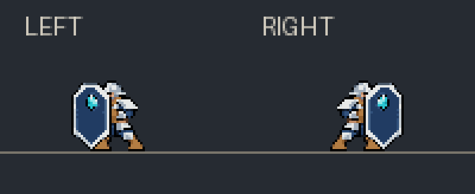

# Issue189 — 宝石盾卫轻跃盾击

用户要求借鉴旧武士/玩家PowerSlash的轻微跃起观感，给盾卫约10秒触发一次的技能。
现有盾击已是近敌自动Bash，因此直接升级该动作，冷却从8秒改10秒，未叠加第二条攻击链。

## 行为与所有权

- 原Bash 8帧/12fps：第1帧时点开始轻跃、第3帧时点到最高并沿用原一次命中、第5帧时点落地，余下帧收势。
- 显示层最高上抬0.12世界单位、向前0.18；左右对称，每帧以native renderer本帧位置为基准绝对采样。
- 唯一写入者是既有`HeavyShieldActorVisuals.CopyLook`，只动自有`KEM_HeavyShieldBody`显示子物体。
- 原生角色/刚体/碰撞体/移动目标仍由原控制器负责。没有实际起跳力、Knight动作钩子、新扫描或新纹理/池。
- 原1点伤害、最多3普通敌人、每目标life去重、原范围与盾耐久规则保持；击退继续走原命中流程。
- 非Bash或落地后偏移为0；格挡/破盾中断在同一显示生产点归位；暂停冻结既有动作时钟，停用/换代按原owned显示生命周期退役。

`Patch_HeavyShieldLeapBash.cs`是无Unity/IO/状态的采样器。初版worker按北京时间夜间规则使用
OMP `deepseek/deepseek-flash` / `max`，native session模型事件证明无fallback；Operator在现有producer统一接线。

## 验证

生产链接纯采样39项通过；生产Runtime/Combat/Life/Visuals 841断言、Pose/metadata 796断言、
Policy 6组情景通过。增加10秒边界与旧8秒边界拒绝，真实生产显示producer覆盖左右/有符号父缩放、
暂停/重复回调不累加/本帧anchor变化/Block和Break中断/重新注册/落地收势。测试中既有negative-life场景
有意保留不可归还的凭证，新显示场景用独立synthetic world隔离，没有改产品门控或清空凭证来过测。

Mac ARM实际interop完整构建0警告0错误，禁部署。Policy旧net6测试项目由CLR8 major roll-forward执行，
其编译已有NETSDK1138提示；不改变项目框架或游戏runtime。独立review批准修复点/ownership与实现。
本机证据在`.local/tasks/shield-hop-bash-20261008/`，源SHA记录在validation.json。

预览直接链接生产PoseMachine/帧表/采样器导出数据，再绘制原PNG，证明素材与采样关系。
它是CPU离线模拟，不证明真实Unity hierarchy旋转/渲染/GPU、战斗观感或玩家验收。
主客姿态同步沿现有路径，本次不新增网络API，也不把本地preview当联机验收。

下次正式版本把此条按既有盾击表现/节奏优化累计patch +1，不因候选或内部返修重复计分。
候选不新建release/tag。正常累计安装由主operator统一协调，安装/实机回执单独记录。
